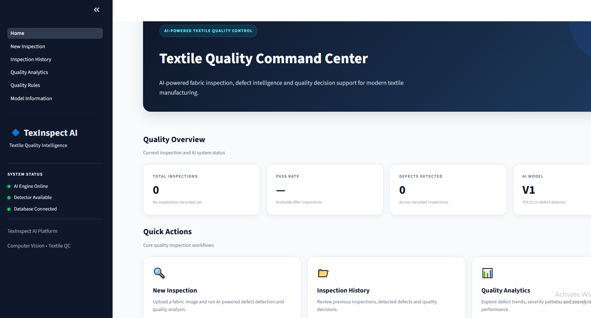
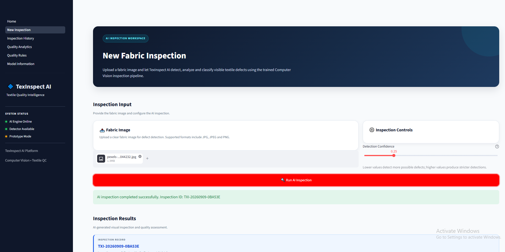
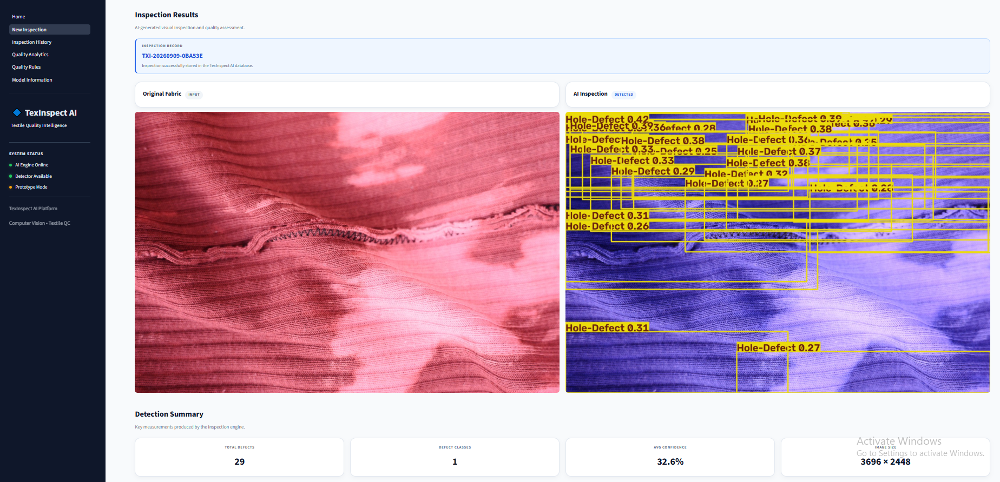
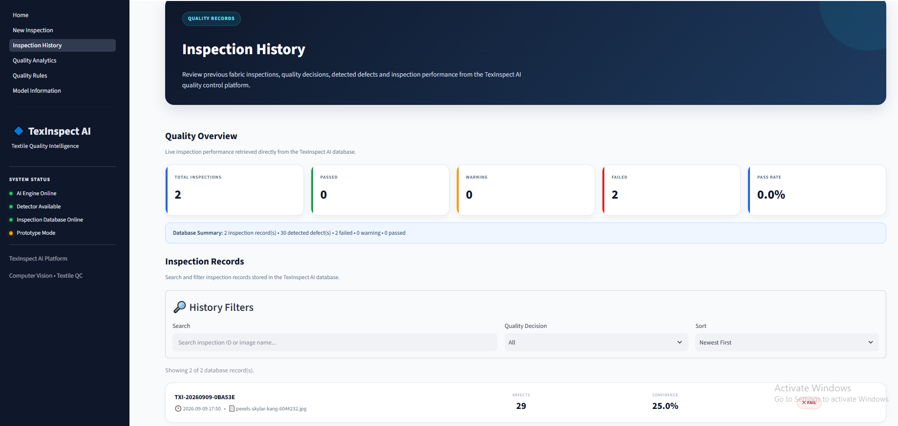
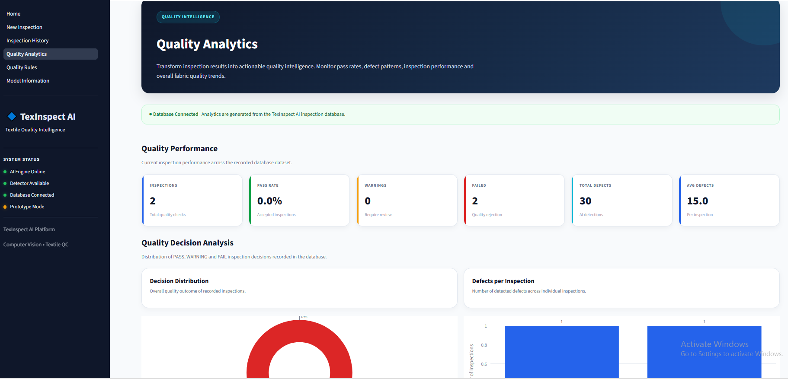

# 🧵 TexInspect AI

<div align="center">

### Intelligent Textile Quality Inspection & Defect Intelligence Platform

AI-powered fabric defect detection, analysis, severity classification, and explainable quality decision support.

<br>

[](https://www.python.org/)
[](https://streamlit.io/)
[](https://github.com/ultralytics/ultralytics)
[](https://www.sqlalchemy.org/)
[](https://www.sqlite.org/)
[](https://creativecommons.org/licenses/by/4.0/)
[]()

</div>

---

## 📌 Overview

**TexInspect AI** is an end-to-end AI-powered textile quality inspection platform designed to support modern fabric quality control workflows.

The system uses a custom-trained **YOLO11n object detection model** to automatically identify textile defects from fabric images. Detection results are then processed through a structured intelligence pipeline that performs:

* Defect detection
* Defect analysis
* Bounding box analysis
* Relative area calculation
* Defect location analysis
* Severity classification
* Rule-based quality decision making
* Inspection persistence
* Historical inspection tracking
* Quality analytics

The final result is an explainable quality decision:

> 🟢 **PASS**
> 🟡 **WARNING**
> 🔴 **FAIL**

TexInspect AI is designed as a Computer Vision prototype for textile manufacturing quality control and can serve as a foundation for future industrial inspection systems.

---

# ✨ Key Features

<table>
<tr>
<td width="50%">

### 🤖 AI Defect Detection

Custom YOLO11n model for automated textile defect detection.

</td>

<td width="50%">

### 🔍 Defect Intelligence

Analyzes size, location, confidence, bounding boxes, and affected area.

</td>
</tr>

<tr>
<td>

### ⚠️ Severity Classification

Classifies detected defects into:

* Minor
* Moderate
* Major
* Critical

</td>

<td>

### 🎯 Quality Decision Engine

Generates explainable:

* PASS
* WARNING
* FAIL

decisions.

</td>
</tr>

<tr>
<td>

### 🗄️ Inspection Database

SQLite and SQLAlchemy-based inspection persistence.

</td>

<td>

### 📊 Quality Analytics

Visual insights into inspections, defects, decisions, and severity.

</td>
</tr>

<tr>
<td>

### 📁 Inspection History

Review previously completed inspections and defect details.

</td>

<td>

### 🖼️ Image Persistence

Stores original and annotated inspection images.

</td>
</tr>
</table>

---

# 🏭 Problem Statement

Traditional textile quality inspection often depends heavily on manual visual inspection.

This can result in challenges such as:

* Human error
* Inspector fatigue
* Inconsistent defect identification
* Slow inspection processes
* Difficulty maintaining inspection records
* Limited analytical insights
* Difficulty tracking recurring defects

TexInspect AI explores how Computer Vision can support textile quality control by automatically detecting known fabric defects and transforming AI predictions into meaningful inspection intelligence.

---

# 💡 Solution

TexInspect AI provides a structured inspection pipeline:

```text
Fabric Image
     │
     ▼
Image Upload
     │
     ▼
YOLO11n Detection Model
     │
     ▼
Defect Detection
     │
     ▼
Defect Analysis
     │
     ▼
Severity Classification
     │
     ▼
Quality Decision Engine
     │
     ▼
PASS / WARNING / FAIL
     │
     ▼
Database Persistence
     │
 ┌───┴────────────┐
 ▼                ▼
History        Analytics
```

---

# 🖥️ Application Preview

## 🏠 Textile Quality Command Center

The application provides a centralized dashboard for monitoring inspection activity and accessing core quality workflows.



---

## 🔍 New AI Inspection

Users can upload a fabric image and run an AI-powered quality inspection.



---

## 🤖 AI Detection Results

The trained YOLO11n model detects textile defects and produces an annotated inspection image.



---

## 📁 Inspection History

Previously completed inspections can be reviewed from the inspection database.



---

## 📊 Quality Analytics

Inspection and defect data are transformed into quality insights and visual analytics.



---

# 🧠 AI Inspection Pipeline

TexInspect AI follows a layered architecture.

```text
┌───────────────────────────────┐
│       FABRIC IMAGE INPUT      │
└───────────────┬───────────────┘
                │
                ▼
┌───────────────────────────────┐
│        YOLO11n DETECTOR       │
│                               │
│  • Defect Class               │
│  • Confidence                 │
│  • Bounding Box               │
└───────────────┬───────────────┘
                │
                ▼
┌───────────────────────────────┐
│      DEFECT ANALYSIS ENGINE   │
│                               │
│  • Width                      │
│  • Height                     │
│  • Area                       │
│  • Relative Area              │
│  • Location                   │
└───────────────┬───────────────┘
                │
                ▼
┌───────────────────────────────┐
│        SEVERITY ENGINE        │
│                               │
│  MINOR → MODERATE → MAJOR     │
│             → CRITICAL        │
└───────────────┬───────────────┘
                │
                ▼
┌───────────────────────────────┐
│      QUALITY DECISION ENGINE  │
│                               │
│    PASS / WARNING / FAIL      │
└───────────────┬───────────────┘
                │
                ▼
┌───────────────────────────────┐
│       INSPECTION DATABASE     │
│                               │
│  • Inspection Records         │
│  • Defect Records             │
│  • Inspection Images          │
└───────────────────────────────┘
```

---

# 🔬 Defect Classes

The current TexInspect AI model detects four textile defect classes.

| Class                  | Description                                               |
| ---------------------- | --------------------------------------------------------- |
| 🟣 Foreign Body Defect | Unwanted foreign material or object present on the fabric |
| 🔴 Hole Defect         | Hole or damaged opening in the fabric                     |
| 🟠 Stain Defect        | Visible stain or discoloration                            |
| 🔵 Thread Defect       | Thread-related irregularity or defect                     |

### Model Configuration

```yaml
nc: 4

names:
  - Foreign-Body-Defect
  - Hole-Defect
  - Stain-Defect
  - Thread-Defect
```

---

# 🧠 AI Model

## TexInspect Detector V1

| Property       | Value                      |
| -------------- | -------------------------- |
| Architecture   | YOLO11n                    |
| Task           | Object Detection           |
| Domain         | Textile Quality Inspection |
| Defect Classes | 4                          |
| Input          | Fabric Image               |
| Output         | Defect Detections          |
| Framework      | Ultralytics                |
| Processing     | CPU Compatible             |

### Model Location

```text
models/
└── detector/
    └── texinspect_detector_v1/
        ├── best.pt
        └── last.pt
```

The application uses the trained model to return:

```text
Defect Type
Confidence Score
Bounding Box
Defect Location
Annotated Image
```

---

# ⚙️ Quality Intelligence System

TexInspect AI does more than object detection.

Raw YOLO predictions are converted into meaningful inspection intelligence through multiple processing layers.

---

## 1️⃣ Defect Analysis

For every detected defect, the system calculates:

```text
Bounding Box Coordinates

Bounding Box Width

Bounding Box Height

Bounding Box Area

Relative Area

Center Coordinates

Defect Location
```

---

## 2️⃣ Severity Classification

Detected defects are classified into:

| Severity    | Meaning                     |
| ----------- | --------------------------- |
| 🟢 MINOR    | Low-impact defect           |
| 🟡 MODERATE | Noticeable quality issue    |
| 🟠 MAJOR    | Significant quality problem |
| 🔴 CRITICAL | Severe quality issue        |

Severity can be influenced by:

* Defect characteristics
* Bounding box size
* Relative affected area
* Defect type
* Inspection rules

---

## 3️⃣ Quality Decision

The Quality Decision Engine converts inspection intelligence into an explainable final result.

### PASS

```text
No significant quality issues detected.
```

### WARNING

```text
Quality concerns detected that require attention.
```

### FAIL

```text
Major or critical quality issues detected.
```

The system also stores a **decision reason** to improve inspection explainability.

---

# 🗄️ Database Architecture

TexInspect AI uses:

```text
SQLite
+
SQLAlchemy ORM
```

Database location:

```text
data/database/texinspect.db
```

---

## Inspection

Each AI inspection creates one inspection record.

```text
Inspection
│
├── Inspection ID
├── Image Name
├── Image Width
├── Image Height
├── Confidence Threshold
├── Defect Count
├── Quality Decision
├── Decision Reason
└── Inspection Timestamp
```

Example:

```text
TXI-20260909-0BA53E
```

---

## Defect

Each inspection can contain multiple defects.

```text
Defect
│
├── Defect Type
├── Confidence
├── Bounding Box
├── Width
├── Height
├── Area
├── Relative Area
├── Location
└── Severity
```

### Relationship

```text
ONE INSPECTION
       │
       │
       ▼
MANY DEFECTS
```

---

# 🖼️ Inspection Image Storage

TexInspect AI stores inspection images using the following structure:

```text
data/
└── external/
    └── inspections/
        └── TXI-YYYYMMDD-XXXXXX/
            ├── original.jpg
            └── annotated.jpg
```

This allows inspection records to maintain associated visual evidence.

---

# 📊 Application Pages

## 🏠 Home

**Textile Quality Command Center**

Provides:

* Inspection overview
* Dynamic KPIs
* Quick actions
* System intelligence information

---

## 🔍 New Inspection

Users can:

* Upload JPG images
* Upload JPEG images
* Upload PNG images
* Configure detection confidence
* Run AI inspection
* Review original images
* Review annotated images
* Analyze defects
* Review severity
* Review quality decisions

---

## 📁 Inspection History

Provides access to:

* Previous inspections
* Inspection IDs
* Inspection timestamps
* Quality decisions
* Defect counts
* Defect details
* Inspection images

---

## 📊 Quality Analytics

Provides insights into:

* Total inspections
* Pass rate
* Total defects
* Average defects per inspection
* Decision distribution
* Defect distribution
* Severity distribution
* Inspection trends
* Top detected defects

---

## ⚙️ Quality Rules

Provides visibility into the quality intelligence rules used to support severity and decision evaluation.

---

## 🧠 Model Information

Provides information about:

* TexInspect Detector V1
* YOLO11n architecture
* Defect classes
* Model capabilities
* System limitations

---

# 🏗️ Project Architecture

```text
TexInspect-AI/
│
├── app/
│   │
│   ├── core/
│   │   ├── detector.py
│   │   ├── defect_analysis.py
│   │   ├── severity_engine.py
│   │   └── decision_engine.py
│   │
│   ├── database/
│   │   ├── db.py
│   │   ├── models.py
│   │   ├── inspection_service.py
│   │   └── image_service.py
│   │
│   ├── pages/
│   │   ├── 1_New_Inspection.py
│   │   ├── 2_Inspection_History.py
│   │   ├── 3_Quality_Analytics.py
│   │   ├── 4_Quality_Rules.py
│   │   └── 5_Model_Information.py
│   │
│   ├── utils/
│   │   ├── config.py
│   │   └── image_utils.py
│   │
│   └── Home.py
│
├── data/
│   ├── database/
│   │   └── texinspect.db
│   │
│   └── external/
│       └── inspections/
│
├── docs/
│   ├── screenshots/
│   ├── ARCHITECTURE.md
│   ├── dataset_profile.md
│   ├── INSTALLATION.md
│   ├── PROJECT_DOCUMENTATION.md
│   └── USAGE_GUIDE.md
│
├── models/
│   ├── anomaly/
│   ├── classifier/
│   └── detector/
│       └── texinspect_detector_v1/
│
├── scripts/
│   ├── dataset_audit.py
│   ├── investigate_empty_labels.py
│   └── visualize_dataset.py
│
├── tests/
│
├── training/
│
├── requirements.txt
└── README.md
```

---

# 🚀 Installation

## 1. Clone the Repository

```bash
git clone https://github.com/YOUR_USERNAME/TexInspect-AI.git
```

```bash
cd TexInspect-AI
```

---

## 2. Create Virtual Environment

### Windows

```bash
python -m venv .venv
```

Activate:

```bash
.venv\Scripts\activate
```

### Linux / macOS

```bash
python3 -m venv .venv
```

Activate:

```bash
source .venv/bin/activate
```

---

## 3. Install Dependencies

```bash
pip install -r requirements.txt
```

---

## 4. Run TexInspect AI

```bash
streamlit run app/Home.py
```

The application will open in your browser.

---

# 📦 Requirements

Main technologies include:

```text
streamlit
ultralytics
torch
torchvision
pillow
opencv-python
numpy
pandas
plotly
sqlalchemy
```

See:

```text
requirements.txt
```

for the complete dependency list.

---

# 🧪 Dataset

TexInspect AI was developed using the:

**Patterned Fabric TILDA Dataset — Version 2**

Dataset characteristics:

| Property          | Value     |
| ----------------- | --------- |
| Total Images      | 500       |
| Image Size        | 640 × 640 |
| Training Images   | 400       |
| Validation Images | 50        |
| Test Images       | 50        |
| Defect Classes    | 4         |
| Total Annotations | 475       |

### Defect Distribution

| Defect              | Annotations |
| ------------------- | ----------: |
| Foreign Body Defect |         149 |
| Hole Defect         |         116 |
| Stain Defect        |         107 |
| Thread Defect       |         103 |

For detailed dataset information, see:

```text
docs/dataset_profile.md
```

---

# 📚 Documentation

Detailed project documentation is available in the `docs` directory.

| Document                    | Description                              |
| --------------------------- | ---------------------------------------- |
| 📘 PROJECT_DOCUMENTATION.md | Complete technical project documentation |
| 🏗️ ARCHITECTURE.md         | System architecture and component design |
| ⚙️ INSTALLATION.md          | Installation and environment setup       |
| 📖 USAGE_GUIDE.md           | Application usage instructions           |
| 🔬 dataset_profile.md       | Dataset profile and analysis             |

---

# 🔮 Future Enhancements

Potential future improvements include:

* Real-time camera inspection
* Conveyor belt integration
* Industrial camera support
* Additional defect classes
* Anomaly detection
* Cloud database
* User authentication
* Role-based access
* Production reporting
* REST API integration
* Manufacturing system integration
* GPU deployment
* Multi-model inspection
* Defect trend prediction

---

# ⚠️ Limitations

TexInspect AI is currently a prototype and has the following limitations:

* Limited to four trained defect classes
* Performance depends on the training dataset
* Designed for image-based inspection
* Prototype-level quality rules
* Not validated against a production textile environment
* Production deployment requires customer-specific validation

For real industrial deployment, the system should be validated using:

* Customer fabric types
* Production defect taxonomy
* Industrial camera setup
* Controlled lighting
* Conveyor speed
* Quality standards
* Real manufacturing data

---

# 🛣️ Roadmap

* [x] Dataset audit
* [x] Dataset visualization
* [x] YOLO11n baseline training
* [x] Textile defect detection
* [x] Defect analysis
* [x] Severity classification
* [x] Quality decision engine
* [x] Streamlit application
* [x] Inspection database
* [x] Inspection history
* [x] Inspection image storage
* [x] Quality analytics
* [x] Quality rules interface
* [x] Model information interface
* [ ] Cloud database
* [ ] Authentication
* [ ] Industrial camera integration
* [ ] Production deployment

---

# 👩‍💻 Author

**Ayesha Imran**

AI Engineer | AI Application Developer

Specializing in:

* Artificial Intelligence
* Machine Learning
* Computer Vision
* Deep Learning
* YOLO
* Generative AI
* AI Applications

GitHub: `AyeshaImran-61`

---

# 📄 License & Dataset Notice

This project is developed as an educational and prototype Computer Vision application.

The underlying dataset and trained model usage should follow the original dataset licensing and attribution requirements.

---

<div align="center">

### ⭐ If you found this project interesting, consider starring the repository.

**TexInspect AI — Bringing Computer Vision Intelligence to Textile Quality Inspection.**

</div>
